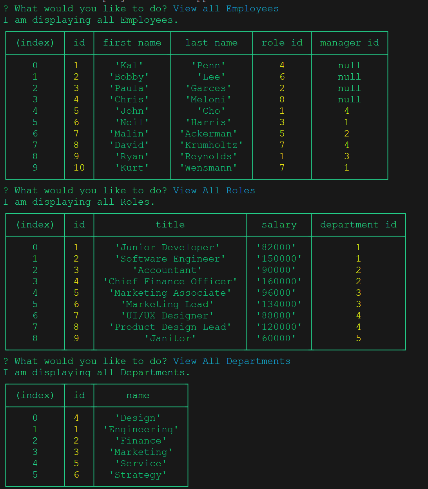

# Employee Tracker App

## Start of APP

- When user starts the application:
  - View All Employees
  - View All Roles
  - View All Departments
  - Add Employee
  - Add Role
  - Add Department
  - Update Employee Role

##  View All

- View All Department:
  - User is presented with a formatted table including: ID -- Name 

- View All Roles:
  - User is presented with a formatted table including: ID -- Title -- Salary -- Deparment ID

- View All Employees:
  - User is presented with a formatted table including: ID -- First Name -- Last Name -- Role ID -- Manager ID

## ADD

- Add Department:
  - User is prompted to enter the following: Name
  - Then that Department is added to the database.

- Add Role:
  - User is prompted to enter the following: Name -- Salary -- Department(it belongs to)
  - Then that Role is added to the database.

- Add Employee:
  - User is prompted to enter the following: First Name -- Last Name -- Role -- Manager
  - Then that Employee is added to the database.

## Update Employee Role

- User is prompted to select from list of Employees.
- User is prompted to select from list of Roles.
  - Then this information is updated in the database

## Video Walkthrough

- 

## Screenshots

